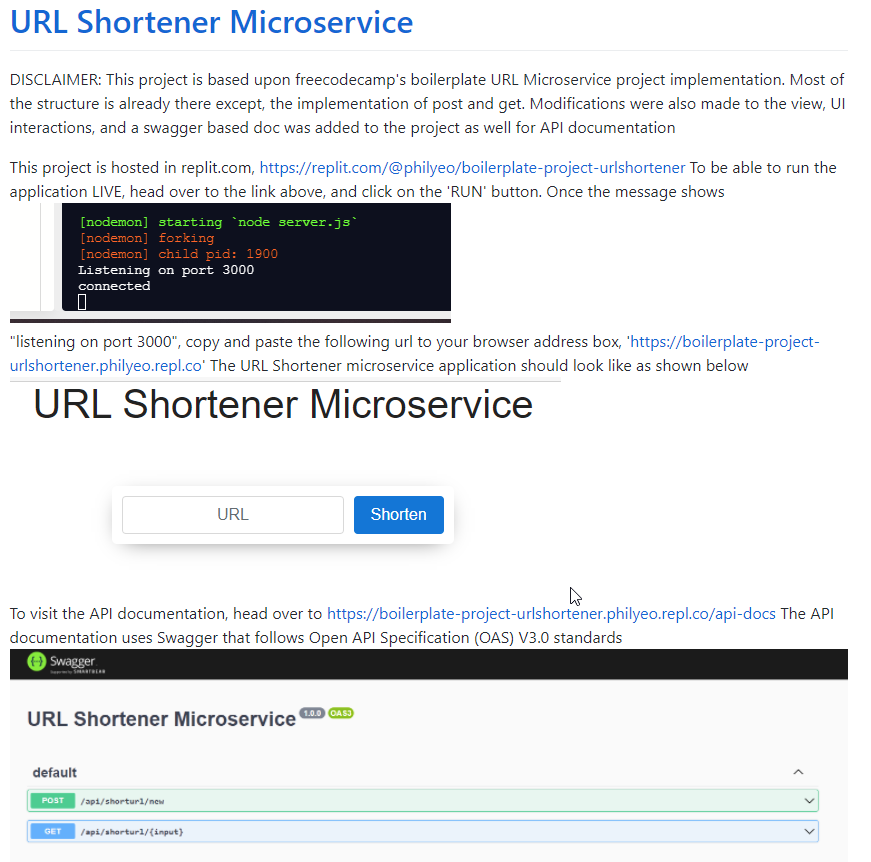

Recently I was given a task to complete – create your own URL shorterner application. If you remember bit.ly or tiny.url, these are clearly examples of URL shorterner application. Its not overly complicated. Although, it wasn’t something that I have done before. But given my recent scouring of knowledge in Javascript and API development, I told myself it should be an interesting project to take on.

Initially, I wanted to use Java and Java spring boot as the foundation framework for building the API. But given that one of the requirements was to have it live up and running and the time it takes to build it, I decided to go with Javascript instead.

Freecodecamp to the rescue. So I have been using freecodecamp for my new tech skill refresher (along with LinkedIn learning and also some other popular tech youtubes like Javabrains, etc.) And I remembered that freecodecamp, did have some special projects for folks to attempt to complete. One of the projects is the URL shorterner. Lo and behold, I put together the project and have posted it on github. https://github.com/philyeo/urlshorterner

So as you can see, I even got a readme done in there. My initial setup was to have it running in replit.com where I don’t have to go and host it on AWS or anything. Its still there, but I’ve since added a Dockerfile in my project and now, should anyone have docker engine install, could download a image and build a node base container immediately to test it. How cool is that.